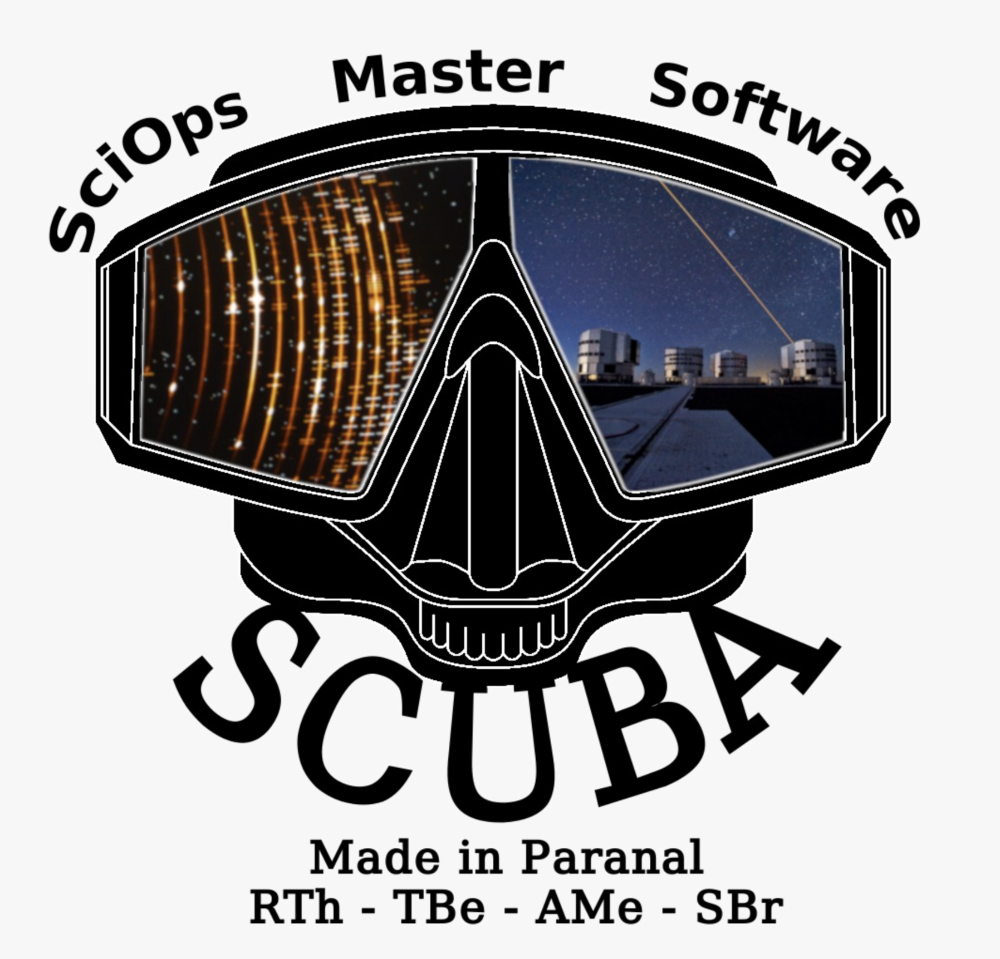
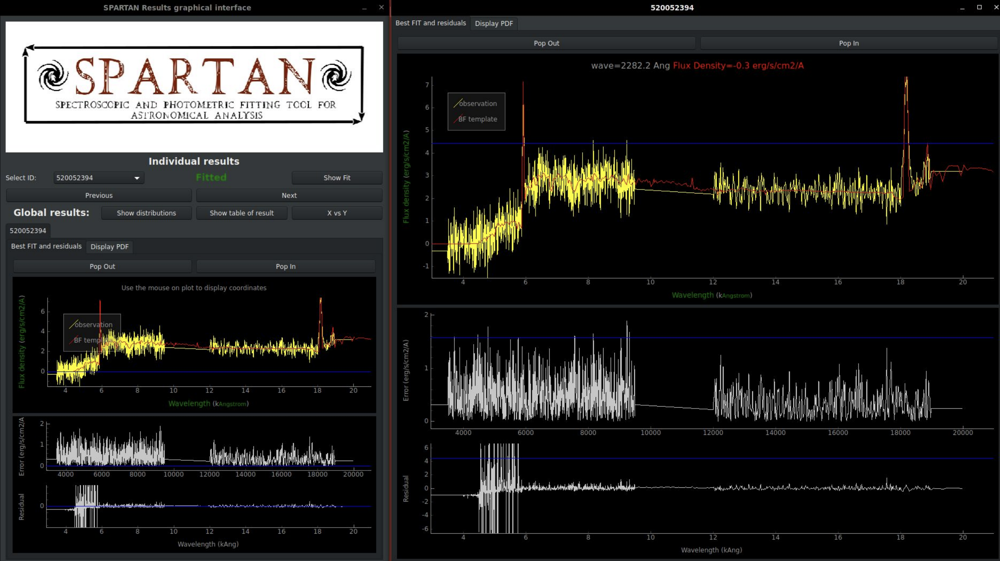



 

Since I started coding during my PhD I wrote multiple pieces of codes. Some more useful than others and some better written than others. It is only during my postdoc time that I started to think that since 95% of my time in research is passed coding something I might as well learn how to write it correctly and how to release in the wild.

And so I did! I learnt how to use github, how to write documentation, tests, how to package something etc...Some have also been published in journals!
So here is the list of Software I have worked on. They are more or less in reversed chronological order.

PS: I have two github account [astrom-tom](https://github.com/astrom-tom) which I do not use anymore (and I am completely locked out of it) and the one I use daily [Romain-Thomas-Shef](https://github.com/Romain-Thomas-Shef). 

 

STON: SofTware for petrOgraphic visualisatioN

During my first year as Head of RSE in Sheffield I took on a small software project with a researcher in Germany, Evgenia Dammer. The goal of the work was to create a tool that would make her daily work easier. We created STON, an interface that is focused on the visualisation and analysis of thin sections of rock and minerals samples. It is made entirely in Python using PySide6 and fully open source. We release a first version in 2025 and published it in the Journal of Open Source Software (see [here](https://joss.theoj.org/papers/10.21105/joss.08144) for the paper). You can find the documentation hosted in [github](https://romain-thomas-shef.github.io/STON/).  

<figure class="center">

<figcaption color=white>Main window of STON.</figcaption>
</figure>

 

SCUBA

SCUBA is the project I started at the Very Large Telescope. Each night, hundreds of Gb of data are created at the VLT. These data are all different. They can be simple images of regions of sky (like with FORS2 imaging mode), data cube (like with MUSE or KMOS), spectra (Xshooter, or the now retired VIMOS). Each of these instrument is very specific and the data they produce have to be checked carefully to make sure that they comply with observer requirements. SCUBA's role is to do exactly this, check each single piece of data taken at each instrument and tell the observer/telescope operator if this is compliant with the requirements. We started the implementation in the UT2 telescope and then it spreaded all over the observtory. While I am not working at the VLT anymore, I know that SCUBA is still actively developed (and I am quite proud of it!). SCUBA was presented and published at the [SPIE conference](https://www.spiedigitallibrary.org/conference-proceedings-of-spie/11449/2560271/The-SCUBA-project---First-layer-of-quality-control/10.1117/12.2560271.full). Unfortunately, SCUBA is not open source (:disappointed:).    

<figure class="center">

<figcaption color=white>Logo of SCUBA.</figcaption>
</figure>

 
SPARTAN

This is one of the first big software I created for my research. It was a tool that was doing photometry and spectroscopy fitting for galaxy data. In short, you observe a galaxy with a telescope, and you try to estimate the physical parameters of this galaxy (such as age, metal content, star formation rate, dust content, etc...) by comparing it to a load of theoretical models. It took me quite some time to actually develop it. The documentation is available [here](https://astrom-tom.github.io/SPARTAN/build/html/index.html) and this has been published as well in [A&C](linkinghub.elsevier.com/retrieve/pii/S2213133720300810).

<figure class="center">

<figcaption color=white>SPARTAN graphical interface.</figcaption>
</figure>

 
SEDOBS
This is a small tool that I created when I was developing SPARTAN (see above). To test SPARTAN I needed some simulation of galaxies. So I created an easy tool that does this: create fake data. It is quite simple to use and I managed to publish it in [Astronomy and Computing](https://www.sciencedirect.com/science/article/abs/pii/S2213133719300046). Documentation is ([here](https://astrom-tom.github.io/SEDobs/build/html/index.html))

<figure class="center">

<figcaption color=white>Example of simulated galaxy data.</figcaption>
</figure>

 
dfitspy
This is something I have developed at the VLT for the SCUBA project and decided to release in the wild. It is a FITS header metadata searcher and displayer (the main file format used in astronomy). It is based on very old tools developed by ESO and that are not supported anymore. So I made a Python version of it. It was published in [JOSS](https://joss.theoj.org/papers/10.21105/joss.01249) and the documentation is [here](https://romain-thomas-shef.github.io/dfitspy/build/html/index.html). Based on pepy.tech, it has been downloaded more than 27000 times.  

 
Photon
This is a software that created purely because I was tired of writing the same codes over and over to make plots. This is an interface that helps you make (pretty) plots very easily. It is also at that time that I took an interest in deceloping graphical user interfaces in Python and creating stand alone tools. I really enjoyed making it. Go have a look at the [documentation](https://romain-thomas-shef.github.io/Photon/build/html/index.html).

<figure class="center">

<figcaption color=white>Example of plot made from Photon.</figcaption>
</figure>

 
Ephemerides
This was done as well at the VLT. Ephemerides is a very short module that retrieves the night information for a given date and a given observatory. All the informations are extracted from the European Southerm Observatory [ESO] ephemerides webpage that uses the skycalc tool of John Thorstensen. Documentation is [here](https://astrom-tom.github.io/ephemerides/build/html/index.html#).

 
Specstack
Done for one of my papers, specstack is a small module that stacks spectra of galaxies together into a single averaged spectrum. [Documentation](https://astrom-tom.github.io/specstack/build/html/index.html)

<figure class="center">

<figcaption color=white>Example of stacking. The number of stacked spectra is shown at the top left.</figcaption>
</figure>

 
catscii
That's probably the most useless module I created. Just a single class reading an ascii catalog. (See here)[https://github.com/astrom-tom/catscii].

 
Catmatch
A simple command line tool to match two catalogs. See [here](https://github.com/astrom-tom/CatMatch).
 

stpip
This a simple command line tool to scrap pepy.tech python download statistics. See [here](https://github.com/Romain-Thomas-Shef/stpip).
