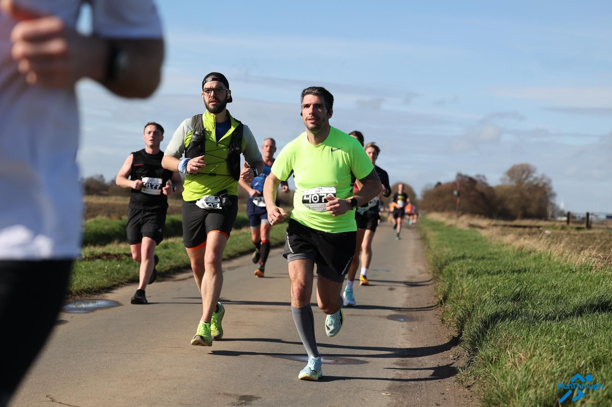
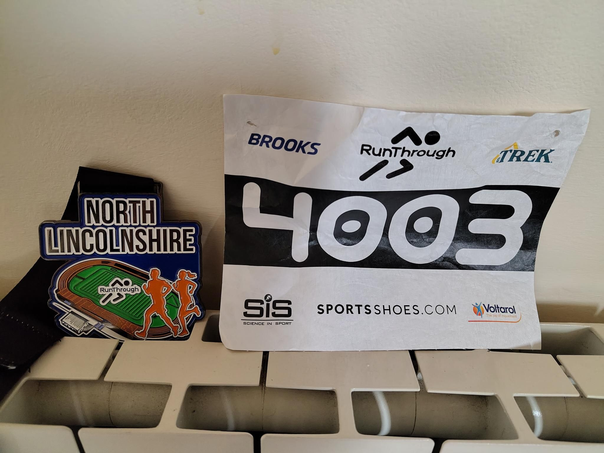

Spring is here! And race are restarting seriously. 

In preparation for the Paris Ecotrail on March 21st I am doing a few small races. That allows me to do kilometers, get prepared, and visit a bit more of the area. 

This one is a half marathon in Scunthorpe. Around 1h of drive and it started at 9.40am so no need to get up too early!
It was a very nice day, very sunny and started to actually feel like spring!
The route is a bit boring to be honest, long straight lines not much turns and all on the road. But the goal was to get the km and finish the week at 80k.  

Since it was flat I tried to go for a PB and I managed to break my record by 2 minutes and finish the race with a pace below 5 min/km! That was great! I finished 655/1668. 

<figure class="center">

<figcaption color=white>Start line</figcaption>
</figure>

 
 
<figure class='center'>

<figcaption color:white>Race bib and medal</figcaption>
</figure>
