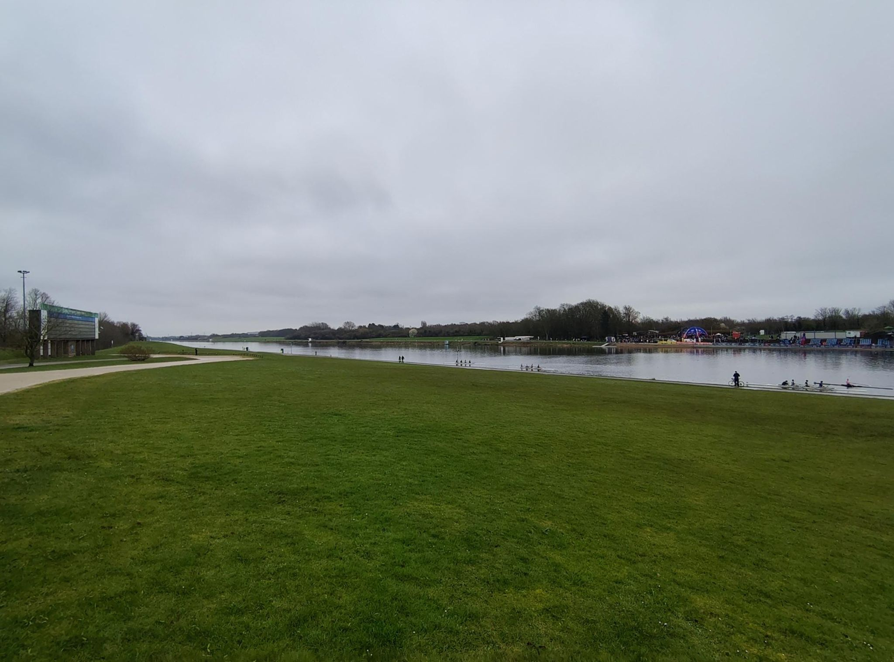
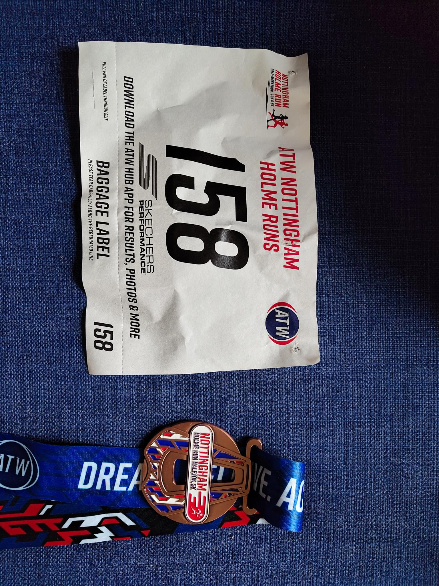

We continue on the spring race serie this week end with the Nottingham Holme Half Marathon. The EcoTrail Paris is in two weeks and I have a race a week in the three weekends before Paris. 

This is one is a half Marathon in Nottingham. It is 4 loops of a small lake where people are usually rowing. It is a 1h drive from home and starts at 10:30 in the morning, so I can even sleep a little bit longer.  Weather was grey, and the race is quite boring. The lake is basically a rectangle, and very flat. This is perfect for a new PB! but quite boring to race.

I finished 104 over 390 registered (chip time) and shaved a minute to my PB! So I was quite happy with the result. What puzzled me is that the first of the race passed me during the 2 loop which is insane. 

<figure class="center">

<figcaption color=white>Lake where we ran with the race HQ in the back.</figcaption>
</figure>

 
 
<figure class='center'>

<figcaption color:white>Race bib and medal</figcaption>
</figure>
