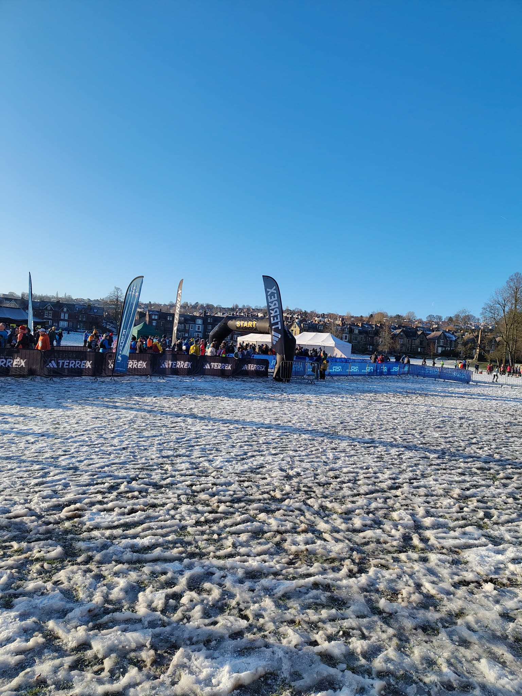
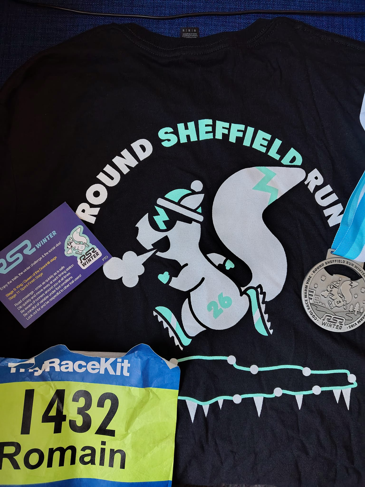

First race of the year! This is the Round Sheffield run winter edition! 

Starts in the Endcliff park goes around the city (not really actually) and comes back to the starting point. Last year I was registered to it but it had been cancelled due to heavy snowfall. This year it snowed as well quite a lot two days before the race but turned to rain and then froze. So a bit part of the route was icy. We were lucky to have a very beautiful day with a lot of sun during the day.  

This race is very particular in the sense that you don't run all the way. It is made of 11 segments, from 400m to 2.5+km. And you are only timed on these segments. The distance between these segments can be walked, or ran (if you really want to).  

I was doing it with a couple of colleagues which was nice! We took it slow and made it nicely to the end!

<figure class="center">

<figcaption color=white>Start line</figcaption>
</figure>

 
 
<figure class='center'>

<figcaption color:white>Race T-shirt and medal</figcaption>
</figure>
