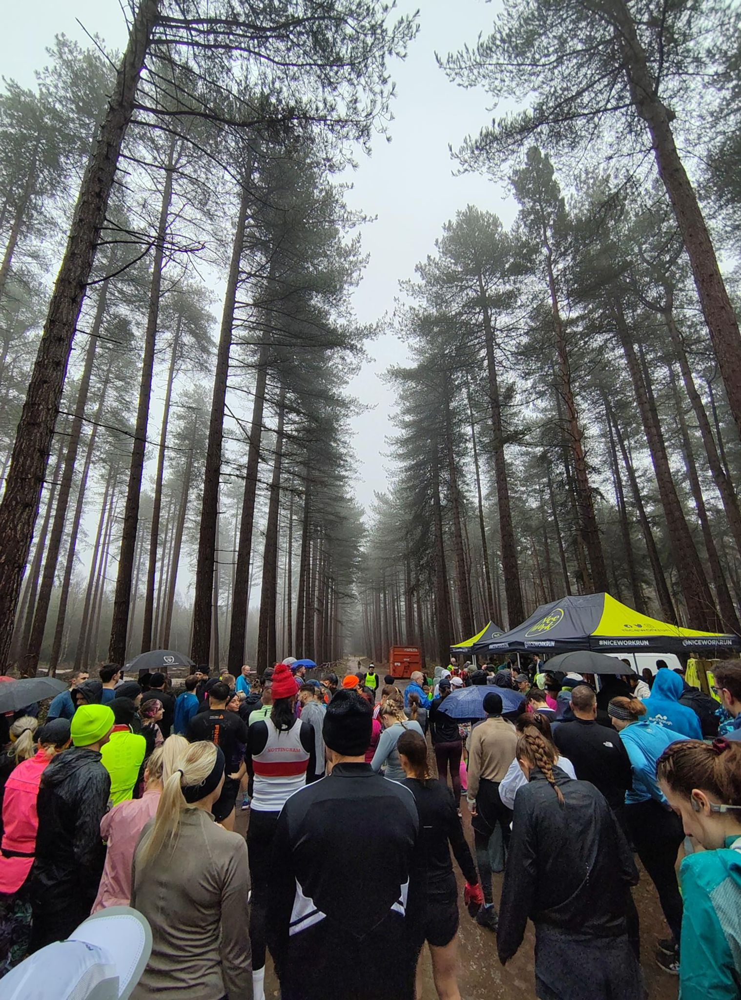
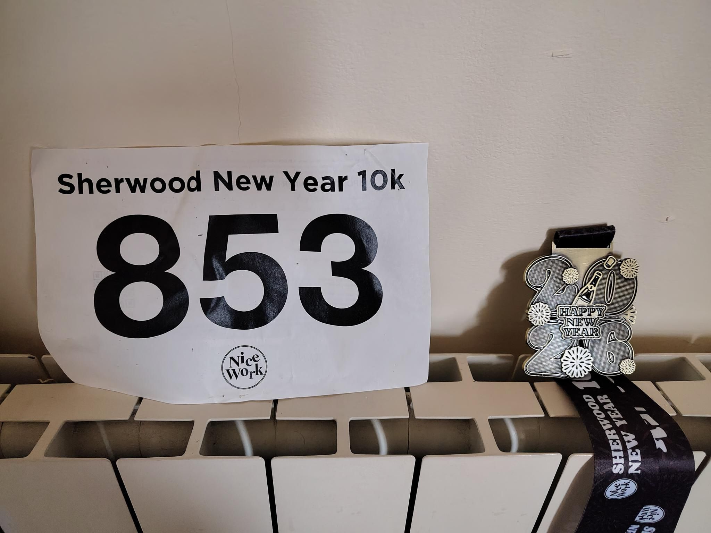

Second race of the year: Sherwood New Year 10k.

I have never been to the Sherwood forest so it was a good occasion. Just a 50min drive and I spent a very nice moment.
No run for a week due to a pain in the front of the leg so I was not sure how it would go. I started slow and felt ok for most of the race. Still a bit of weird feeling in the leg but it went through during the race.
The Sherwood forest is a beautiful place with very tall pine trees (as you can see below). Unfortunately the weather was not very good and it rained most of the race. 

Finished 65/372 so it was a good race!

<figure class="center">

<figcaption color=white>Start line</figcaption>
</figure>

 
 
<figure class='center'>

<figcaption color:white>Race Bib and Medal</figcaption>
</figure>
