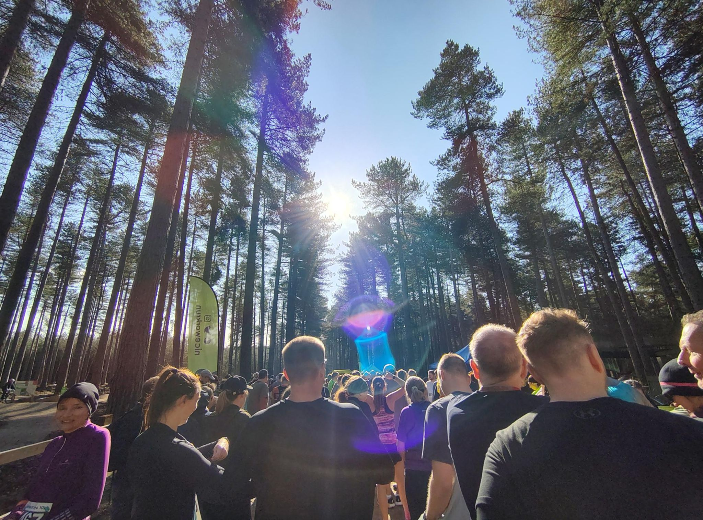
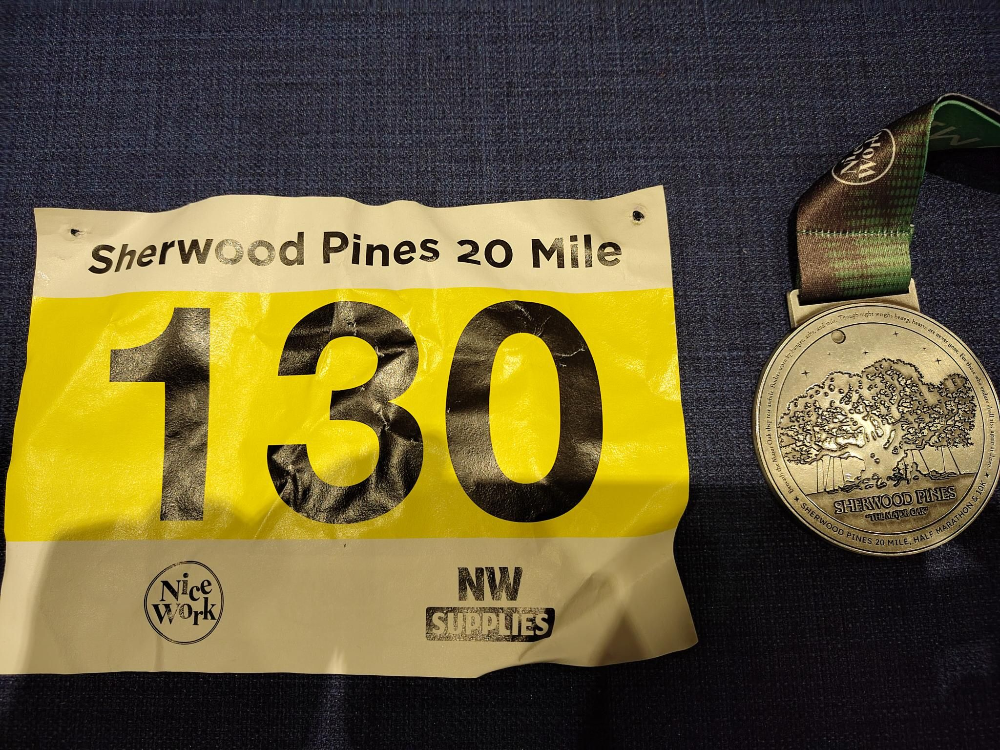
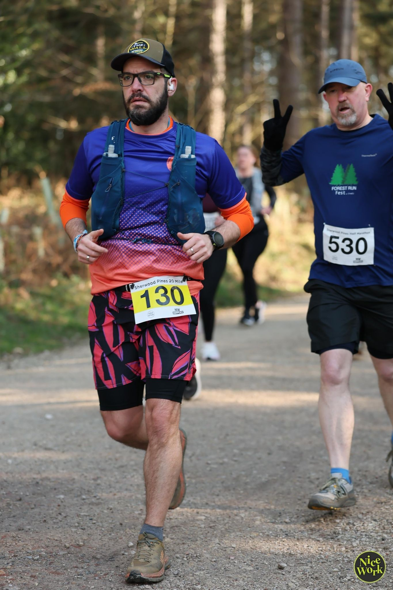
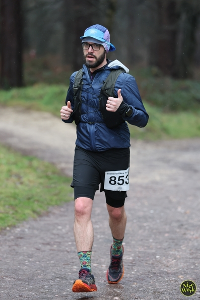

Last "training" race before the big one in Paris. This is one is a 20 miles (~32k) in the Sherwood forest. This is the same place as for the 10k in January. But this time instead of a single loop of 10k we do three loops. 

I started to have a cold a few days before the race so I did not know how it would go. 
We got very lucky with the weather as it was very sunny. I decided to run two loops normally and used the last one in "ultra" mode (walking uphill) so I don't burn myself for the ultra the week after. It went quite well and according to plan. And even with walking for a few portion during the last loop I arrived 36/116 (chip time).

<figure class="center">

<figcaption color=white>Start line</figcaption>
</figure>
 
 
<figure class='center'>

<figcaption color:white>Race Bib and Medal</figcaption>
</figure>
 
 
<figure class='center'>

<figcaption color:white>Race picture</figcaption>
</figure>
 
 
<figure class='center'>

<figcaption color:white>Race pitcure</figcaption>
</figure>


